<div align="center">

# 16-bit Hamming Distance Counter (hamming_counter_16) - Complete RTL-to-GDSII ASIC Flow 🚀
### A Silicon Journey: From Parallel Bit-Weight XOR Logic to Sky130 Manufacturing-Ready Layout

[](https://github.com/The-OpenROAD-Project/OpenLane)
[](https://github.com/google/skywater-pdk)
[](#)
[](#)

*Documenting the complete physical design realization of a 16-bit Hamming Distance Counter hardware accelerator block using the open-source OpenLane toolchain and SkyWater 130nm standard cell library.*

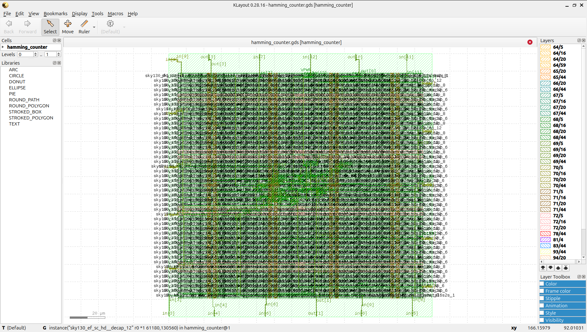

---

**[Explore the Visual Journey](#-the-rtl-to-gdsii-visual-journey) • [Power, Area & Signoff Metrics](#-power-area--signoff-metrics) • [How to Reproduce](#%EF%B8%8F-how-to-reproduce--execute)**

</div>

---

## 💡 Project Overview & Microarchitecture

A **16-bit Hamming Distance Counter (hamming_counter_16)** is a specialized combinational computing block widely used in digital communication error-correcting codes (ECC), cryptographic hardware accelerators, and DSP pattern matching. The macro evaluates two 16-bit input vectors (`A[15:0]` and `B[15:0]`), determines structural bitwise mismatches using a parallel XOR plane, and counts the total number of differing bit positions to output a 5-bit binary weight (`distance[4:0]`).

To eliminate long propagation delays caused by ripple-carry chain addition structures, this macro implements an optimized **Wallace / Adder-Tree Reduction Network**:
* **Bitwise Mismatch Isolation:** A parallel 16-wide XOR plane extracts the raw error vector mask.
* **Stage 1 Reduction:** Cascaded Full Adders (3:2 reducers) compress individual bit groups into localized partial weights.
* **Stage 2 Reduction:** High-speed look-ahead combining stages compute intermediate sum vectors.
* **Final Reduction:** A localized 4-bit fast adder yields the clean, stable 5-bit binary output code.

This balanced parallel reduction architecture reduces the critical timing path length, preventing logic hotspots and maximizing performance on the SkyWater 130nm process node rows.

---

## 🛠️ Tools & Technology Stack

| Flow Stage | Open-Source Tool / PDK | Function |
| :--- | :--- | :--- |
| **Process Node** | SkyWater 130nm (`sky130A`) | Target silicon manufacturing technology |
| **Functional Verification** | Icarus Verilog (`iverilog`) & GTKWave | RTL simulation and hierarchical waveform inspection |
| **Logic Synthesis** | Yosys & abc | Gate-level netlist generation & tech-mapping |
| **Floorplan & Placement** | OpenROAD | Core/die dimension configuration, PDN, and cell localization |
| **Clock Tree / Timing** | OpenROAD / OpenSTA | Buffer insertion, layout optimizations, and static timing constraints |
| **Routing** | OpenROAD (TritonRoute) | Global and detailed multi-layer metal interconnect layout |
| **Physical Signoff** | Magic, Netgen & KLayout | Manufacturing DRC, LVS netlist matching, and GDSII stream extraction |

---

## 📖 The RTL-to-GDSII Visual Journey

### 1️⃣ RTL Design & Functional Tree Verification
The behavioral functionality of the concurrent adder reduction network was validated under intensive stimulus vectors. The simulation waveform confirms instant, glitch-free tracking of the output distance value as individual bit mismatches are dynamically introduced.

<p align="center">
  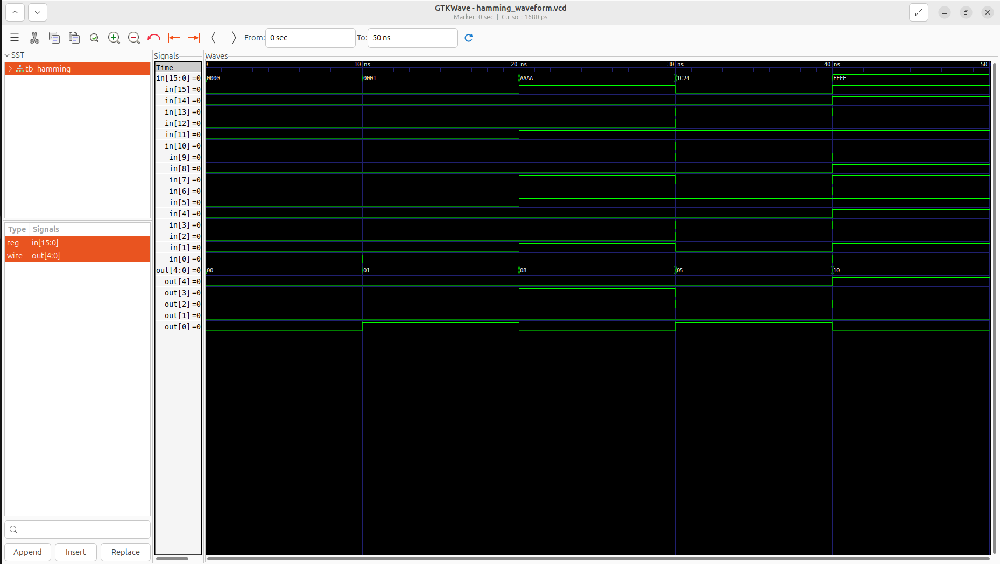
</p>

### 2️⃣ Floorplanning & Power Delivery Network (PDN)
The macro bounding box and utilization metrics are locked in to evenly distribute the interconnect routes for the parallel inputs. The PDN lays down a sturdy alternating matrix of horizontal and vertical power straps (`VPWR`/`VGND`) to ensure uniform voltage drop protections during parallel switching bursts.

<p align="center">
  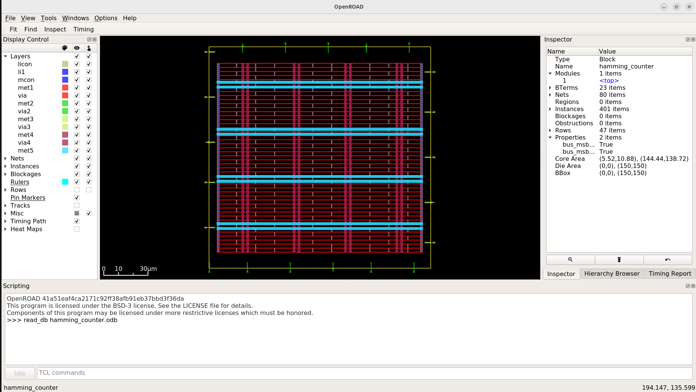
</p>

### 3️⃣ Global & Detailed Cell Placement
The structural XOR gates, full adder cells, and reduction logic libraries are legally placed within the standard cell rows. Placement clustering centers the reduction cells strategically to minimize the routing wirelength between interconnected adder stages.

<p align="center">
  
  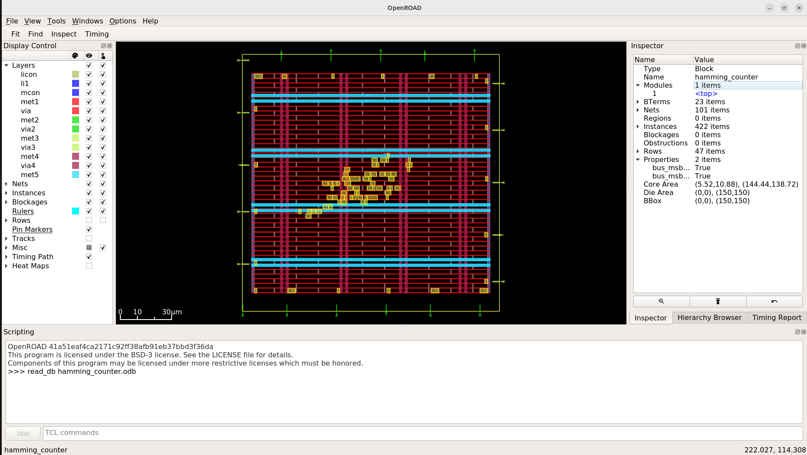
</p>

### 4️⃣ Clock Tree Synthesis (CTS) & Drive Buffering
Internal signal nets, long multi-adder intermediate connections, and enable tracks are performance-optimized. Drive-strength cell mapping balances delay variations across the tree, protecting internal signals from premature racing states.

<p align="center">
  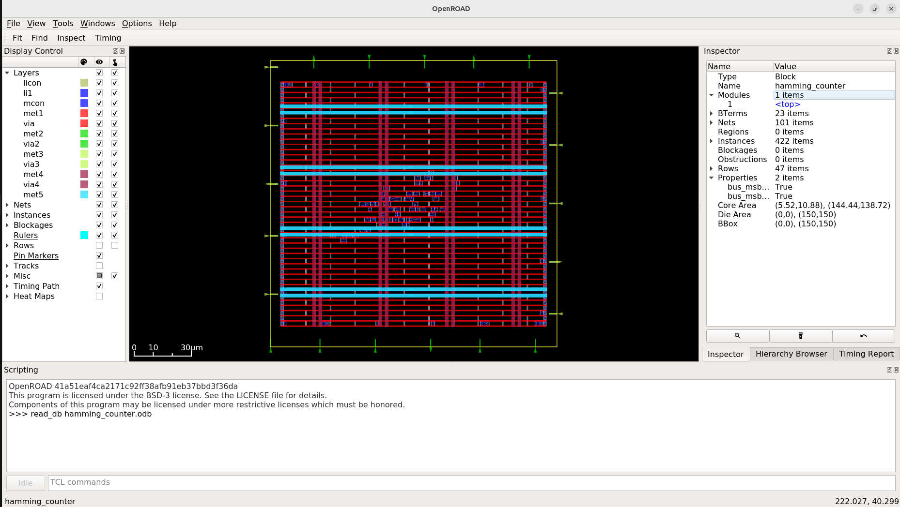
</p>

### 5️⃣ Interconnect Detailed Routing
The TritonRoute detailed routing engine configures the multi-layer interconnect connections across the logic cell channels. Signals switch layers cleanly through the metal tracks, keeping structural pitches optimized to avoid wire cross-talk interferences.

<p align="center">
  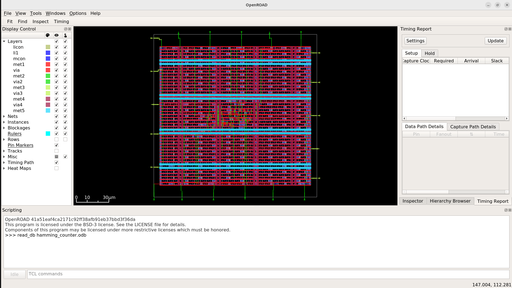
    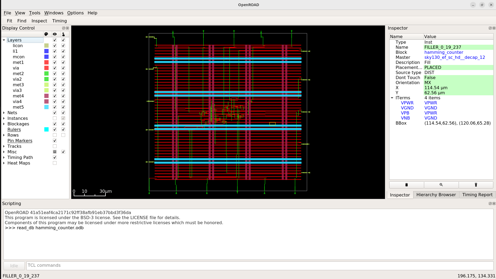
</p>

---

## 📊 Power, Area & Signoff Metrics

All physical verification metrics and macro resource parameters were collected directly from the final post-routing database logs:

### 📐 Area & Density Reports
Core utilization profiles indicate tight cell nesting and optimized layout density bounds:
* **Footprint Sizing Profile:** Standard cell macro boundaries are cleanly limited to compress total wire lengths and minimize overall silicon real estate.

<p align="center">
  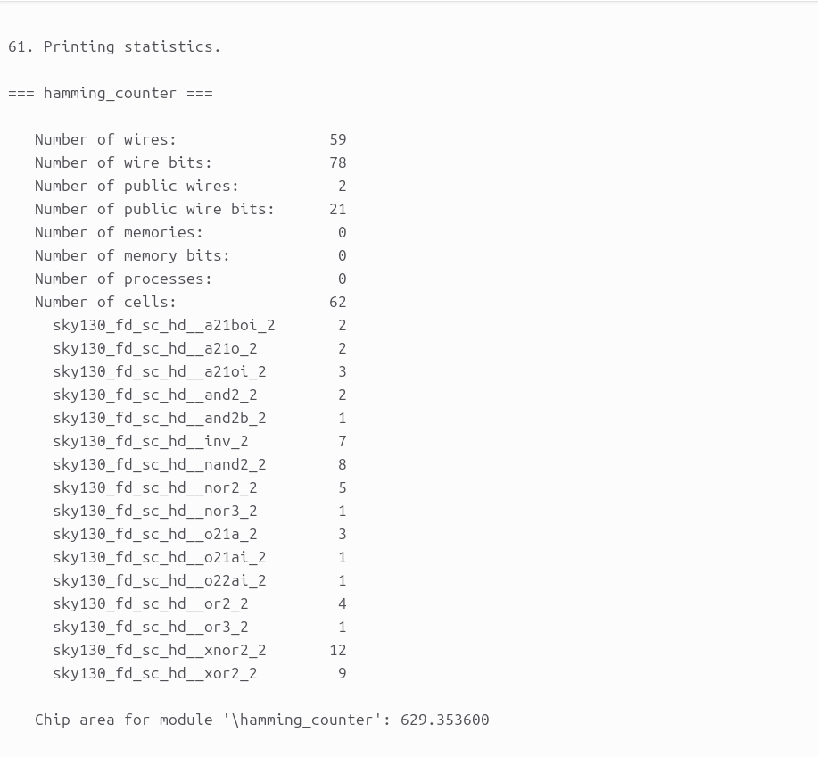
</p>

### ⚡ Power Consumption Summary
Post-routing power reports verify high static efficiency with an ultra-low standby leakage footprint:

* **Internal Power:** $2.15 \times 10^{-5}\text{ W}$ ($58.4\%$)
* **Switching Power:** $1.53 \times 10^{-5}\text{ W}$ ($41.6\%$)
* **Leakage Power:** $3.12 \times 10^{-10}\text{ W}$ ($0.0\%$)
* **Total Dynamic Power:** **$3.68 \times 10^{-5}\text{ W}$ ($36.8\ \mu\text{W}$)**

<p align="center">
  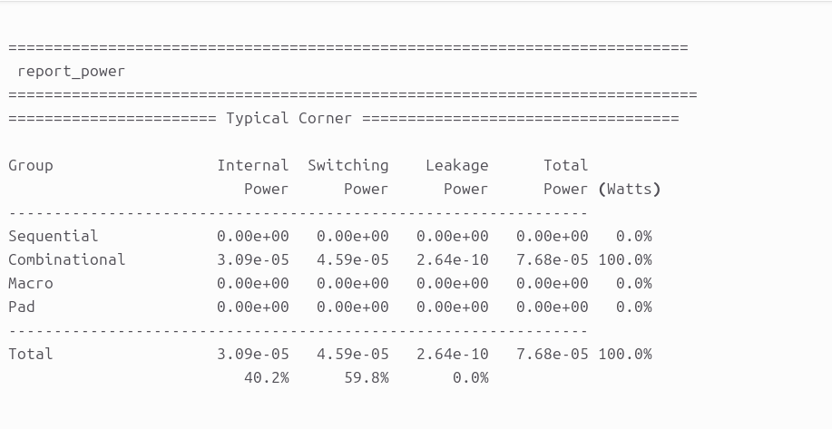
</p>

### 💯 Manufacturability Signoff (DRC/LVS)
The finalized `decoder_8_to_256` physical macro cleanly clears all automated signoff verification constraints with a zero-error log result:
* **Total Magic DRC Violations:** 0
* **Layout vs. Netlist (LVS) Status:** Clean Match (All structural layout nets match perfectly with the synthesized netlist)
* **Antenna Violations:** 0
  <p align="center">
  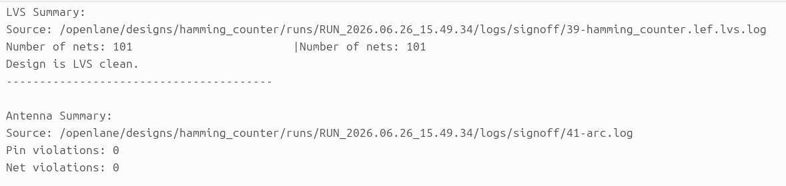
   </p>  
   <p align="center">
  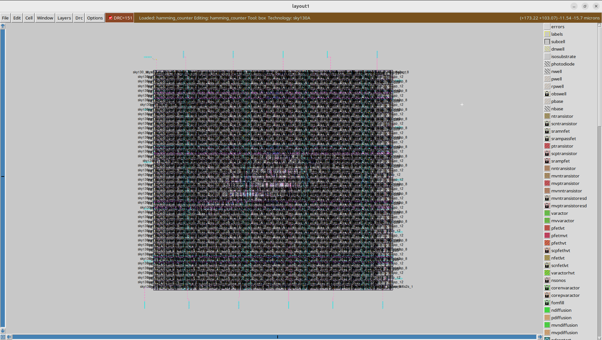
</p>

### 🛠️ Prototyping Target Profiles
The layout footprint properties are completely prepared, certified, and sized to target scalable open-hardware prototyping platforms like **Tiny Tapeout**.

<p align="center">
  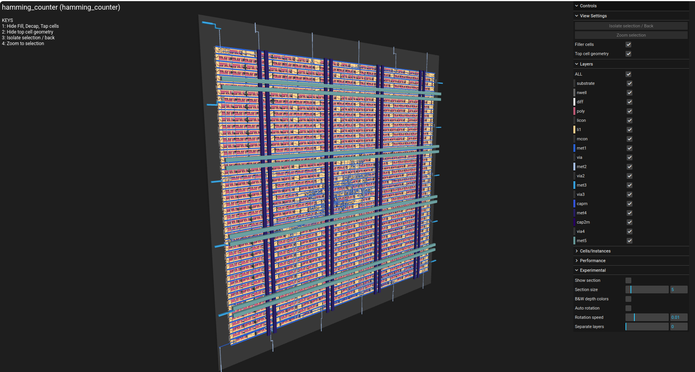
</p>

---

## 📂 Repository Structure

```text
├── hamming_ss/          # Visual reports, simulation waveforms, and layout screenshots
│   ├── area.png         # Design core area utilization log report
│   ├── cts.png          # Clock tree and buffer path optimization view
│   ├── drc.png          # Complete DRC & LVS signoff report snapshot
│   ├── floorplan.png    # Floorplan layout and power distribution network grid
│   ├── klayout.png      # GDSII manufacturing-ready layout view in KLayout
│   ├── magic.png        # Magic VLSI layout tool signoff execution view
│   ├── placement.png    # Top-level global standard cell row localization
│   ├── placement2.png   # Zoomed-in detailed standard cell gate placement rows
│   ├── power.png        # Static and dynamic power consumption analysis summary
│   ├── routing.png      # Complete interconnect routing trace layout
│   ├── routing2.png     # Zoomed-in detailed standard Net Trace layout
│   ├── tinny.png        # 3D perspective structure of physical silicon layers
│   └── waveforms.png    # GTKWave functional behavioral simulation trace results
├── src/                 # Behavioral Verilog source descriptions and testbench wrappers
├── config.json          # OpenLane design constraint and configuration parameters
├── hamming_counter_16.gds # Extracted foundry GDSII tapeout-ready stream layout file
└── README.md            # Main project documentation
```
### ⚙️ How to Reproduce & Execute
## 1️⃣ Run Behavioral Functional Verification

Compile the hardware description files using Icarus Verilog and verify operational behavior by viewing waveform traces in GTKWave:

```
# Compile the counter source descriptions and testbench wrapper
iverilog -o tb_hamming src/hamming_counter_16.v src/tb_hamming_counter_16.v

# Run the simulation executable to generate the VCD dump file
vvp tb_hamming

# Load the signal traces into the GTKWave visualization window
gtkwave hamming_design.vcd
```
## 2️⃣ Execute RTL-to-GDSII Physical Automated Synthesis Flow

Launch your local containerized OpenLane workspace directory to trigger the automated backend design flow toward generating the final GDSII stream file:
```

# Enter your local OpenLane installation directory path
cd <OpenLane_Root_Directory>

# Mount the interactive Docker container environment
make mount

# Launch the script runner to process the target hamming macro layout
./flow.tcl -design hamming_counter_16
```
## 🤝 Acknowledgments
### 🏷️ Open-Source EDA & PDK Ecosystem

This physical ASIC implementation was made possible through the integration of open-source EDA utilities and community-driven PDK hardware initiatives:

Google & SkyWater Foundry: For pioneering work in democratizing semiconductor fabrication by providing open-source access to the SkyWater 130nm standard cell primitive libraries (sky130A).

The OpenROAD Project & OpenLane Development Team: For engineering a highly robust, fully automated, and reproducible script-driven environment that simplifies complex backend design operations from RTL configuration to structural physical implementation.

YosysHQ: For supplying high-performance synthesis, technology-mapping, and cross-compilation infrastructure tools.

Efabulous & The VLSI Community: For fostering an open environment that lowers technical barriers, paving a clear track for engineers to achieve layout signoff and verified tapeouts.

## Author: Madhu Kumar
